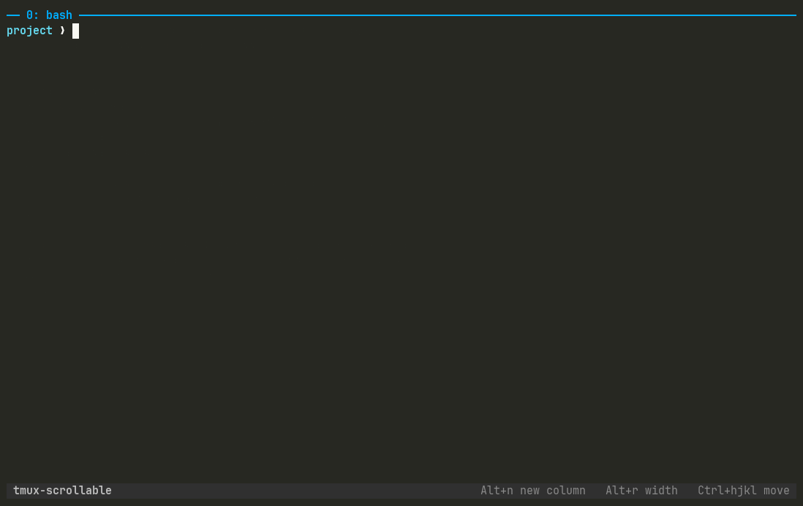

# tmux-scrollable

**Scrollable tiling for tmux, like [niri](https://github.com/YaLTeR/niri) and
[PaperWM](https://github.com/paperwm/PaperWM).** New columns scroll in from the right
instead of squeezing the panes you already have.



## Why

tmux splits a fixed screen: every new pane makes the others smaller. Scrolling window
managers lay windows out on an infinite horizontal strip and scroll the screen along it,
so each window keeps a useful width and you move between them instead of resizing them.
tmux-scrollable brings that model to tmux panes.

If you came from niri, PaperWM, Hyprscroller, Karousel or zellij, this is that idea inside
tmux. tmux's own keys are untouched, and the two new keys work without the prefix.

| Key | Action |
|---|---|
| `Alt+n` | Open a new column right of the current one and scroll to it |
| `Alt+r` | Step the current column through 33.33%, 50%, 66.66% and 100% of the terminal and back down again, like niri's `Mod+R` |
| your usual pane keys | Moving focus scrolls the strip so the whole column is visible. Works with mouse clicks, `select-pane`, and [vim-tmux-navigator](https://github.com/christoomey/vim-tmux-navigator)'s `Ctrl+hjkl` |
| `prefix "` | Still a vertical split: panes stack inside a column, like windows in a niri column |
| `prefix %` | Still tmux's horizontal split, inside the current column |

Column widths are fixed once set, like niri's `fixed` widths: resizing the terminal does
not resize your columns. If the columns are narrower than the terminal, the space after the
last one stays empty, as in niri. A single column always fills the terminal.

## Install

With [TPM](https://github.com/tmux-plugins/tpm):

```tmux
set -g @plugin 'yanglited/tmux-scrollable'
```

then `prefix I`.

### Requirements

- **tmux 3.8 or newer.** tmux 3.7 and older draw a window wider than the terminal with
  ghost borders and misplaced text, and can spin the server at 100% CPU for minutes
  ([tmux issue 5664](https://github.com/tmux/tmux/issues/5664)). The plugin refuses to load
  there.
- **`cursor-offset.patch`** from this repo, until it is upstream. Without it tmux hides
  the cursor whenever the view is scrolled: its visibility check is given screen coordinates
  where it expects window coordinates.
- python3 (for the layout maths). `flock` (util-linux) is used when present to serialise
  concurrent hook runs. Developed and tested on Linux; macOS is untested.

Until 3.8 is released, build a release candidate:

```sh
git clone --depth 1 --branch 3.8-rc3 https://github.com/tmux/tmux.git && cd tmux
patch -p0 < ~/.config/tmux/plugins/tmux-scrollable/cursor-offset.patch
sh autogen.sh && ./configure --disable-debug && make -j"$(nproc)" && install -Dm755 tmux ~/.local/bin/tmux
tmux kill-server   # the running server must be restarted on the new binary
```

### Try my whole tmux setup

My own config at [yanglited/tmux](https://github.com/yanglited/tmux) is a small, readable
tmux.conf with this plugin plus tmux-sensible, tmux-resurrect, tmux-yank and
vim-tmux-navigator (so `Ctrl+hjkl` moves between vim splits and tmux columns alike), a clear
status bar and pane titles, `Alt+hjkl` to swap panes, and `prefix v` to open the pane's
scrollback in nvim. To try it without losing yours:

```sh
mv ~/.config/tmux ~/.config/tmux.bak 2>/dev/null; mv ~/.tmux.conf ~/.tmux.conf.bak 2>/dev/null
git clone https://github.com/yanglited/tmux.git ~/.config/tmux
git clone https://github.com/tmux-plugins/tpm ~/.config/tmux/plugins/tpm
tmux kill-server 2>/dev/null; tmux
```

Inside tmux press `prefix I` (Ctrl+b, then Shift+i) to let TPM install the plugins, then
`Alt+n`. To go back: `tmux kill-server`, delete `~/.config/tmux` and restore the `.bak` copies.

## Options

All optional; these are the defaults.

```tmux
set -g @scrollable-split-key 'M-n'    # key (no prefix) that opens a new column
set -g @scrollable-preset-key 'M-r'   # key (no prefix) that cycles the column width
set -g @scrollable-width 50           # new column width, percent of the terminal
set -g @scrollable-presets '33.33 50 66.66 100' # widths Alt+r steps through, up then back down
set -g @scrollable-log ''             # path of a debug log of every layout change; empty = off
```

## How it works

tmux already supports windows wider than the terminal (`window-size manual` and
`resize-window`) and can pan the visible part (`refresh-client -L/-R`). The plugin keeps
the window exactly as wide as its columns, remembers each column's width in a
`@scrollable_w` pane option, and re-applies the widths through one `select-layout` after
tmux rescales. Columns are read from tmux's own layout tree, so splits inside a column are
left alone.

Panning is explicit: on every focus change the plugin scrolls just enough to show the whole
active column (niri's `center-focused-column "never"`). tmux's own cursor tracking is not
used because it centres the cursor rather than the pane and jumps to the far left whenever
a program hides its cursor.

Hooks are registered under the array key `[tmux-scrollable]`, so hooks you set yourself
are left alone.

## Compared with

- **tmux-tilish / tmux-tilit** give tmux i3-style automatic layouts on one fixed screen.
  tmux-scrollable keeps tmux's manual splits and adds the scrolling strip.
- **zellij** is a different multiplexer. tmux-scrollable keeps tmux, your config and your
  plugins; `Alt+n` for a new pane will feel familiar.

## Limits

- Column widths come from the client that triggered the change; with several clients of
  different sizes attached to one session, the others get a scaled view.
- Columns resized by hand (mouse drag, `resize-pane`) snap back to their stored width on
  the next split, close or `Alt+r`.
- Pane numbers (`prefix q`) follow creation order, so a column inserted mid-strip gets the
  highest number rather than the one matching its position.
- tmux-resurrect restores a scrolled window squeezed into the terminal; columns keep their
  relative sizes but you have to split again to get the wide layout back.

## Tests and demo

`test/e2e.sh` drives a throwaway tmux server with a fake terminal attached and checks
window width, scroll offset and column positions after every operation.
`demo/record.sh` re-records `demo.gif` the same way, with asciinema and agg.

## License

MIT.
